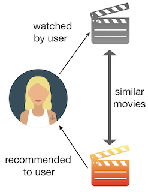
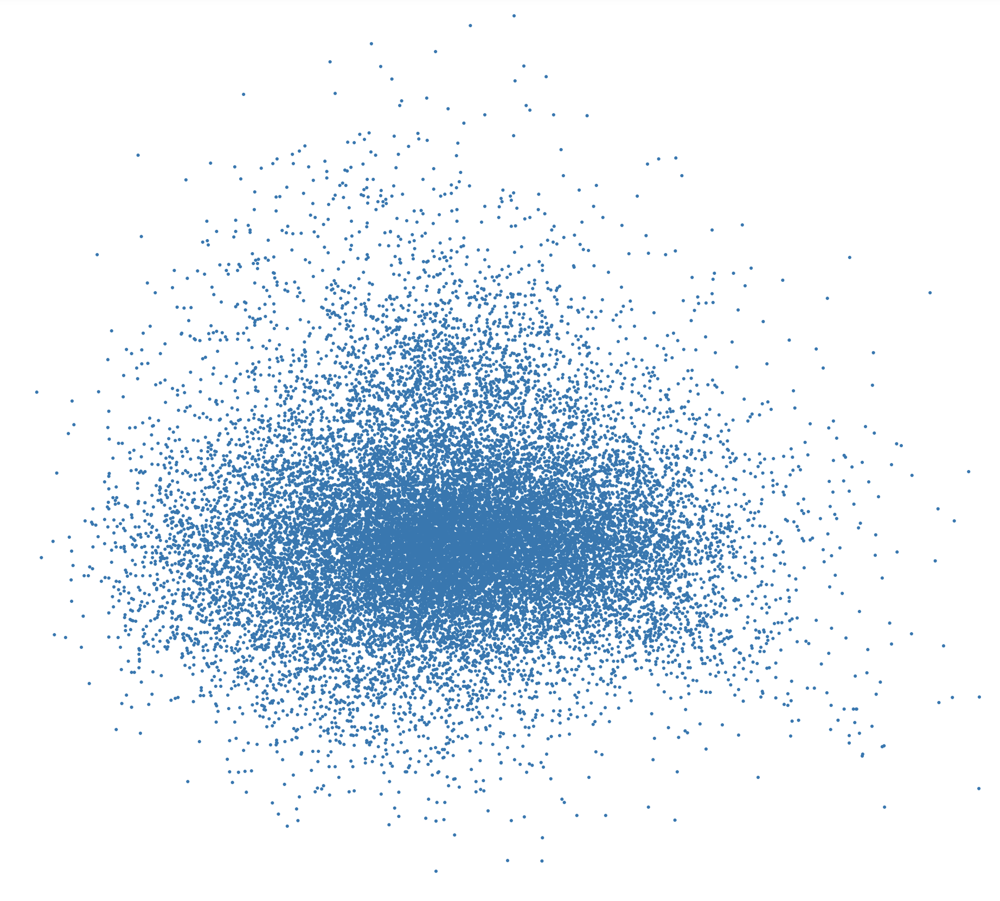
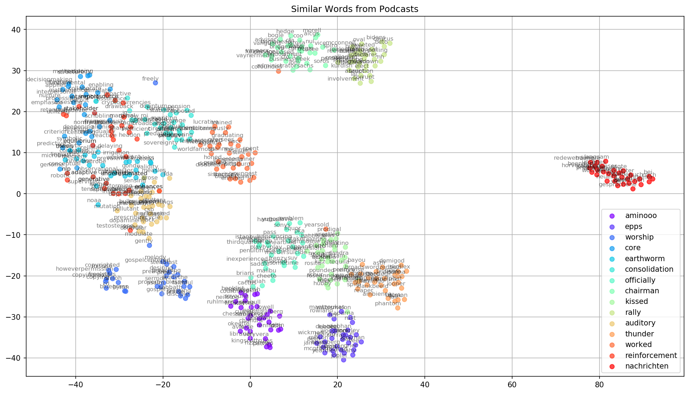

# Podcast Recommendation Engine
Building a content-based podcast recommender system using NLP

## Overview
Listeners may have a handful of regular podcasts they listen to and are usually reluctant or hesitant in listening to something new. Unlike with music or movies, users can't listen to the first 10 seconds or scrub through a preview to see if they like a particular podcast. Podcasts are usually long and topics per podcast vary greatly, which adds to the challenge of matching users to podcasts they might enjoy. Additionally, due to the sheer volume of podcasts and podcast episodes, it's near impossible for users to scour through them all to find the podcast they like.

However, we can potentially aggregate metadata about podcasts that a user does like and employ various NLP techniques to recommend new, similar podcasts that they may enjoy.

### Content-Based Recommendation Systems
A **content-based recommendation system** is one main type of recommender systems that is used to provide recommendations to a user. This type of recommendation system takes in a user's information and preferences and picks items to recommend that are similar in content. With continually growing podcast database, a content-based recommendation engine could select a subset of podcasts (or even specific podcast episodes) and determine an order in which to display them to a user. Based on a user profile, this system could analyze podcast descriptions and identify podcasts that are similar to the user's preferences.



### Measuring Similarity
After building a user's profiles, we must establish a notion of similarity between what a user likes and potential recommendations. For instance, if a user provides a particular podcast that he or she likes, we have to find some way of finding similar podcasts.

Given a particular podcast, we can gather important textual information about that podcast (title, description, episode titles, episode descriptions, etc.). Then, we must compare it with every other podcast in a database and return a list of podcasts that are "similar."

There are many techniques to measure similarities between text, and one logical technique is counting the number of common words between two documents. However, an inherent flaw in this method is that number of common words will naturally increase as document sizes increase even if two documents talk about different topics.

However, another popular and common way of measuring similarity irrespective of text size is to consider the **cosine similarity** between two bodies of text. Since we can represent a set of words as a vector, we can measure the cosine of the angle between two vectors projected on an n-dimensional vector space. Unlike the *Euclidean distance* (number of common words) approach, which measures the magnitude between two vectors, we are now considering the angle.

More information regarding cosine similarity can be found [here](https://www.machinelearningplus.com/nlp/cosine-similarity/).

## Data and Features

For each podcast, I collected the following features:
- Title (text)
- Producer (text)
- Unique Genre (text)
- Description (text)
- Number of Episodes (number)
- Rating (number)
- Number of Reviews (number)
- Episode Titles (for up to the last 6 recent podcasts) (text)
- Episode Descriptions (for up to the last 6 recent podcasts) (text)

## Building a Recommender System using NLP

### Text Pre-processing
Before building any recommendation model, I aggregated all the textual features and pre-processed the text by following these steps:

  1. Removed mixed alphanumeric characters
  2. Removed any URLs
  3. Removed non-alphanumeric and non-space characters
  4. Tokenized text
  5. Removed custom stop words
  6. Stemmed text via [lemmatization](https://www.datacamp.com/community/tutorials/stemming-lemmatization-python)

These are standard pre-processing techniques that I have read and learned about before. An explanation regarding most of these steps can be found [here](https://www.kdnuggets.com/2019/04/text-preprocessing-nlp-machine-learning.html).

### Modeling Approach

Most of the models I decided to build were inspired by this Medium [article](https://medium.com/@adriensieg/text-similarities-da019229c894) as well as other articles and research I read online, which I will later reference down below.

Unlike a supervised learning model, there is no real way of validating the recommendations. So, I decided to select a small set of podcasts (ones that I listen to and other popular ones) and physically see if the model recommendations make logical sense.

I selected the following podcasts to test:
  - [The Daily](https://podcasts.apple.com/us/podcast/the-daily/id1200361736) (News)hardstark/id1074507850) (True Crime)
  - [This American Life](https://podcasts.apple.com/us/podcast/this-american-life/id201671138) (Society and Culture)
  - [Joel Osteen Podcast](https://podcasts.apple.com/us/podcast/joel-osteen-podcast/id137254859) (Religion & Spirituality)
  - [TED Radio Hour](https://podcasts.apple.com/us/podcast/ted-radio-hour/id523121474) (Technology)
  - [Call Her Daddy](https://podcasts.apple.com/us/podcast/call-her-daddy/id1418960261) (Comedy)
  - [Skip and Shannon: Undisputed](https://podcasts.apple.com/us/podcast/skip-and-shannon-undisputed/id1150088852) (Sports)

My approach is to feed these selected podcasts into various recommendation engines, output the 10 most similar podcasts for each one, and manually verify if the recommendations *make sense*. Essentially, the model that performs the "best" is one that recommends other podcasts in maybe the same genre or same domain.

It's important to note this is a *subjective* assessment and just because a podcast recommendation matches the same genre as the input doesn't necessarily mean that it is a good recommendation. A good recommendation has also to do with the content of the podcast itself, which I will try to assess given my domain knowledge in podcasts.


### Models
Each model follows a standard recipe: **Word Embedding + Cosine Similarity**. An **embedding** is an NLP technique to transform words into some type of vector representation. Different embedding methods will produce different numerical representations. Details regarding embedding methods can be found [here])https://www.analyticsvidhya.com/blog/2017/06/word-embeddings-count-word2veec/ and [here](https://www.kdnuggets.com/2019/10/beyond-word-embedding-document-embedding.html).

The goal is to find a good embedding technique that clusters similar podcasts together so that the cosine distance between any two similarly clustered podcasts is low.

My blog where different techniques for similarity and embedding are discussed
[Link]https://deeplearningit.blogspot.com/2021/07/nlp-algorithms-and-techniques.html


#### 1. CountVectorizer (Bag-of-Words) + Cosine Similarity
The [Bag-of-Words](https://machinelearningmastery.com/prepare-text-data-machine-learning-scikit-learn/) model ignores the order of the information and only considers the frequency of words in a text. So, the CountVectorizer method identifies each unique word and builds a vocabulary of seen words. Then, each text document is transformed into a fixed-length vector (length of the vocabulary of known words) where each entry of the vector denotes the count of that word.


```
from sklearn.feature_extraction.text import CountVectorizer
from sklearn.metrics.pairwise import cosine_similarity

cv = CountVectorizer()
cv_matrix = cv.fit_transform(podcasts_df["text"])
cv_cosine_sim = cosine_similarity(cv_matrix)
```

#### 2. TFIDF + Cosine Similarity
[Term Frequency-Inverse Document Frequency (TF-IDF)](https://pathmind.com/wiki/bagofwords-tf-idf) works similarly to BoW, however, each entry of the fixed-length vector is now replaced with TF-IDF. TF-IDF is another type of calculation that gives each word in the text an assigned weight. First, the frequency of a term in a document is calculated (Term Frequency) and is penalized by that same term appearing in every other document. The idea is to penalize words that appear frequently in a text (i.e. "and" or "the") and given them less value.


```
from sklearn.feature_extraction.text import TfidfVectorizer

tf = TfidfVectorizer()
tf_matrix = tf.fit_transform(podcasts_df["text"])
tf_cosine_sim = cosine_similarity(tf_matrix)
```

#### 3. GloVe Embedding + Cosine Similarity
Developed by Stanford researchers, the [GloVe](https://nlp.stanford.edu/projects/glove/) embedding method attempts to capture semantic meaning in a vector space. In short, consider the ubiquitous [example](https://www.technologyreview.com/s/541356/king-man-woman-queen-the-marvelous-mathematics-of-computational-linguistics/):

*king - man + woman = queen*

GloVe is very similar to Word2Vec (which is another embedding method that precedes GloVe), but was built fundamentally different. GloVe (and Word2Vec) is much too long to explain, so I will reference the resources I used to learn about the two:

  * [GloVe](https://mlexplained.com/2018/04/29/paper-dissected-glove-global-vectors-for-word-representation-explained/)
  * [Word2Vec](https://towardsdatascience.com/introduction-to-word-embedding-and-word2vec-652d0c2060fa)

```
from gensim.models import KeyedVectors

glove_model = KeyedVectors.load_word2vec_format("../word2vec/glove.6B.50d.txt.word2vec")

glove_mean_embedding_vectorizer = MeanEmbeddingVectorizer(glove_model)
glove_mean_embedded = glove_mean_embedding_vectorizer.fit_transform(podcasts_df['text'])
glove_cosine_sim = cosine_similarity(glove_mean_embedded)
```

#### 4. Custom Trained Word2Vec + Cosine Similarity
Either you can use a pre-trained word embedding, or you can train your Word2Vec embedding. Usually, training and building your own set of word vectors is a good approach for a domain-focused NLP project like this one.

There are 2 approaches to training a Word2Vec model
  * BoW
  * skip-gram

I decided to go with the skip-gram approach as it yields (in my opinion) better results. Also, according to [Mikolov](https://en.wikipedia.org/wiki/Tomas_Mikolov) (the inventor of Word2Vec), skip-gram works better with small training data. Details regarding these two methods can be found [here](https://stackoverflow.com/questions/38287772/cbow-v-s-skip-gram-why-invert-context-and-target-words)!

```
from gensim.models import Word2Vec
from nltk.tokenize import RegexpTokenizer

text_list = list(podcasts_df.text)
tokenized_text = [tokenizer.tokenize(i) for i in text_list]

w2v_model = Word2Vec(tokenized_text, sg=1)

mean_embedding_vectorizer = MeanEmbeddingVectorizer(w2v_model)
mean_embedded = mean_embedding_vectorizer.fit_transform(podcasts_df['text'])
w2v_cosine_sim = cosine_similarity(mean_embedded)
```

This model performed the **best** in my opinion.

**Podcast Word Embedding Visualizations**


*Each blue dot represents a word in a 2D vector space*


*Shows the clustering of similar words that were randomly chosen from the above graph*


Overall, I believe this recommendation model does a good job of recommending similar podcasts based on the input (based on my small test set). As an avid podcast listener and someone familiar with many of these podcast titles, these recommendations make sense given the time in which the data was compiled (mid-Nov 2019). Not only does the model cluster well, but it also recommends relevant podcasts across different genres too. Compared to the other models, this one outperformed by recommending the most similar podcasts.
